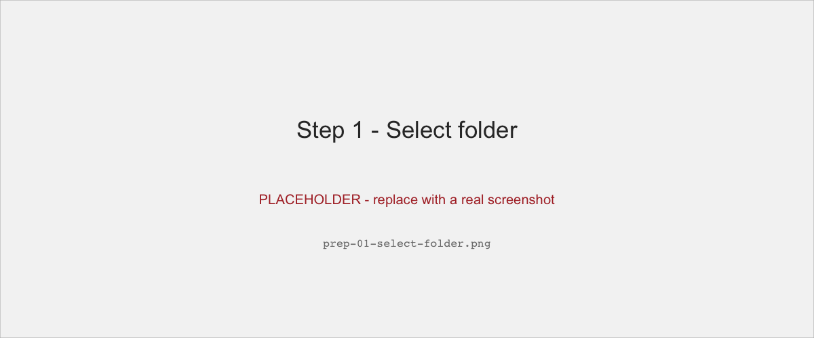
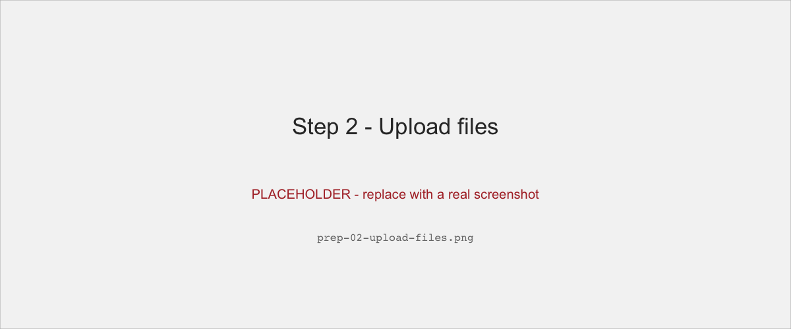
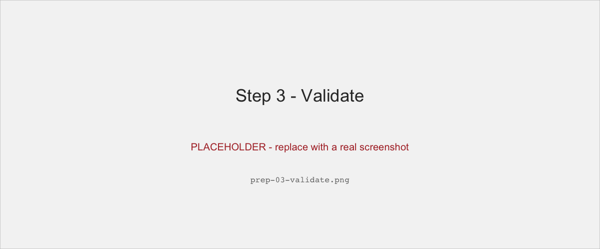
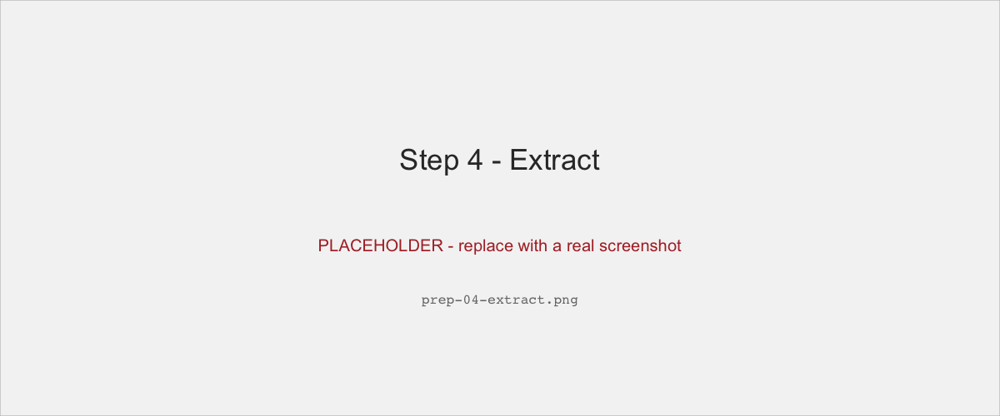
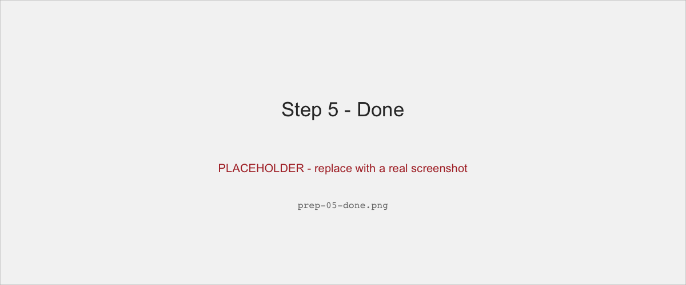

This vignette takes you from a folder of BAM files to a dataset you can
explore in `microhaplot`, without installing R, Perl, or `samtools` on your
machine, and without typing a single line of R. Everything runs inside
Docker, and all the interaction happens in your web browser.

It is aimed at people who produce the data — field technicians, lab staff,
students — rather than at bioinformaticians. If you are comfortable in an R
console and already have the package installed, the `prepHaplotFiles()`
function documented in the *microhaplot data prep* vignette does the same
job in one call.

You need two things before starting:

- **Docker Desktop**, installed and running.
- **Your aligned data**: one BAM file per individual, and a VCF file
  defining the SNP positions you want to extract. Where those come from is
  covered in the *microhaplot data prep* vignette.

## How the pieces fit together

`microhaplot` ships as a single Docker image that runs two separate apps:

| App | Address | What it does |
|-----|---------|--------------|
| **Field Genotyping Prep** | <http://localhost:3839> | Turns BAM + VCF into a `.rds` dataset |
| **microhaplot** | <http://localhost:3838> | Explores, filters, and genotypes that dataset |

The important part is what they share. Both apps run with the same home
directory, and that home directory is a folder on *your* machine, mounted
into both containers. So a file the prep wizard writes is, physically, the
same file the main app reads — no copying between tools, no restarting
anything, and nothing hidden inside a container that you can't get at from
your own file browser.

That folder is `./microhaplot-data` by default, and it is the only place
you ever need to put anything.

## One-time setup

Download `docker-compose.yml` — you don't need to clone the repository:

```{sh get-compose, eval = FALSE}
curl -O https://raw.githubusercontent.com/ltalignani/microhaplot-2/master/docker-compose.yml
```

Create the shared data folder next to it:

```{sh mkdir-data, eval = FALSE}
mkdir -p ./microhaplot-data
```

## Getting your data into the shared folder

Put your BAM files and your VCF into a subfolder of `./microhaplot-data`.
Using a subfolder per run, rather than the folder root, keeps your data
separate from the `Shiny/` directory the apps create there for their own
use.

If you just want to follow along, `microhaplot` bundles a demo dataset of
20 rockfish samples — 20 BAM files, a VCF, and a ready-made metadata TSV.
Unpack it with:

```{sh unpack-demo, eval = FALSE}
mkdir -p ./microhaplot-data/sebastes-demo
tar xzf "$(Rscript -e 'cat(system.file("extdata", "sebastes_bam.tar.gz", package = "microhaplot"))')" \
  -C ./microhaplot-data/sebastes-demo
```

If you don't have R on your machine at all, download
`inst/extdata/sebastes_bam.tar.gz` from the repository and unpack it into
`./microhaplot-data/sebastes-demo` by hand.

Either way you should end up with:

```{sh demo-listing, eval = FALSE}
./microhaplot-data/sebastes-demo/
├── s6.bam, s11.bam, … (20 BAM files)
├── sebastes_metadata.tsv
└── sebastes.vcf
```

### The metadata TSV

Alongside your BAM files, the wizard needs a tab-separated file with one
row per individual and a header row naming four columns:

| Column | Required | Meaning |
|--------|----------|---------|
| `bam_file` | yes | File name of the BAM, as it appears in the folder |
| `individual_id` | yes | Your identifier for the individual; must be unique |
| `group` | no | Population, site, or batch label used for grouping in the main app |
| `color` | no | Hex colour (`#RRGGBB`) used for that group in plots |

The first rows of the demo file look like this:

```
bam_file	individual_id	group	color
s6.bam	s6	gr	#1f77b4
s11.bam	s11	cu	#ff7f0e
s13.bam	s13	p	#2ca02c
```

You don't have to write this file from memory — step 2 of the wizard has a
**Download TSV template** button that gives you the header row to fill in.

## Starting the apps

From the folder containing `docker-compose.yml`:

```{sh compose-up, eval = FALSE}
docker compose up
```

The first run downloads the image, which takes a few minutes. Subsequent
runs start in seconds. Leave the terminal open — closing it stops the apps.

Then open <http://localhost:3839> in your browser for the prep wizard.

## The wizard, step by step

The wizard has five steps, shown as a progress indicator across the top.
You can go back at any point before extraction starts.

### Step 1 — Select folder



Click **Browse for folder…** and pick the folder holding your BAM files —
`sebastes-demo` if you're using the demo data.

The browser you get here shows the *container's* filesystem, but because
the container's home directory is your shared folder, `home` is exactly
`./microhaplot-data` on your machine. Your subfolder is right there. This
is the one place where the Docker setup might feel surprising, and it is
the reason everything else needs no explanation.

Once a folder is selected, its path appears in green and a **Next →**
button becomes available.

### Step 2 — Upload files



Provide two files here:

- **Metadata TSV** — the file described above.
- **VCF file** — the variant positions to extract. Both plain `.vcf` and
  gzipped `.vcf.gz` are accepted.

Unlike step 1, these are genuine uploads, so you can pick them from
anywhere on your machine, not only from the shared folder. When both are
in place, a **Validate →** button appears.

### Step 3 — Validate



Nothing is extracted yet. This step runs every check up front and reports
*all* the problems it finds at once, rather than stopping at the first one:

- every BAM named in your TSV actually exists in the selected folder;
- `individual_id` values are present and unique, and any `color` values
  are valid hex codes;
- no BAM file is truncated or corrupted (`samtools quickcheck`);
- the chromosome names in your VCF match the reference names in your BAM
  headers — the check that catches a VCF and a BAM panel that don't
  belong together.

On the demo data all four checks pass. If something fails, fix it and
click back to the relevant step; the **Start extraction →** button only
appears once validation is clean.

### Step 4 — Extract



Extraction runs in a background process, so your browser stays responsive,
and a progress bar tracks it sample by sample. This is the same
`prepHaplotFiles()` machinery documented elsewhere — the wizard is a front
end to it, not a second implementation.

On the 20-sample demo dataset this takes a few seconds. On a full field
campaign of several hundred samples, expect minutes.

### Step 5 — Done



The wizard reports the two files it wrote and where they are:

```
~/Shiny/microhaplot/prep_20260811_120306.rds
~/Shiny/microhaplot/prep_20260811_120306_posinfo.rds
```

The run is named `prep_` followed by a timestamp, so repeated runs never
overwrite each other. On your own machine these files are under
`./microhaplot-data/Shiny/microhaplot/`.

## Opening the result in the main app

Now go to <http://localhost:3838>. The **Data Set** dropdown lists every
dataset present in the shared folder: the bundled `fish1.rds` and
`fish2.rds` examples, plus your own `prep_<timestamp>.rds` runs. Pick
yours and carry on with the *microhaplot walkthrough* vignette, which
covers filtering, genotype calling, and population genetics.

You do not need to restart anything. The main app reads the same directory
the wizard just wrote to, so a dataset extracted a moment ago is already
in the list.

Extracted from the demo data, you should see 616 haplotype observations
across 8 loci in 20 individuals, split into four groups (`cu`, `gr`, `p`,
`w`).

## Stopping and starting again

In the terminal running the apps, press `Ctrl-C`, then:

```{sh compose-down, eval = FALSE}
docker compose down
```

Everything you extracted stays in `./microhaplot-data`. Starting the apps
again with `docker compose up` picks up exactly where you left off — your
datasets are still in the dropdown.

## Notes and troubleshooting

**Windows users get BAM support here.** Called directly from R on Windows,
`prepHaplotFiles()` refuses BAM input. Under Docker the restriction simply
doesn't apply: the container is Linux inside whatever your host OS is, so
BAM files work the same way they do on macOS or Linux. This first release
is tested on macOS and Linux; Windows via Docker Desktop and WSL2 is
expected to work but is not yet verified.

**Ports already in use.** If something else on your machine occupies 3838
or 3839, set `MICROHAPLOT_MAIN_PORT` and `MICROHAPLOT_PREP_PORT` in a
`.env` file next to `docker-compose.yml`.

**Permission errors on Linux.** If the containers can't write to
`./microhaplot-data`, set `MICROHAPLOT_UID` and `MICROHAPLOT_GID` in that
same `.env` file to match your own user (`id -u` and `id -g`). See the
Troubleshooting section of the README for details.
